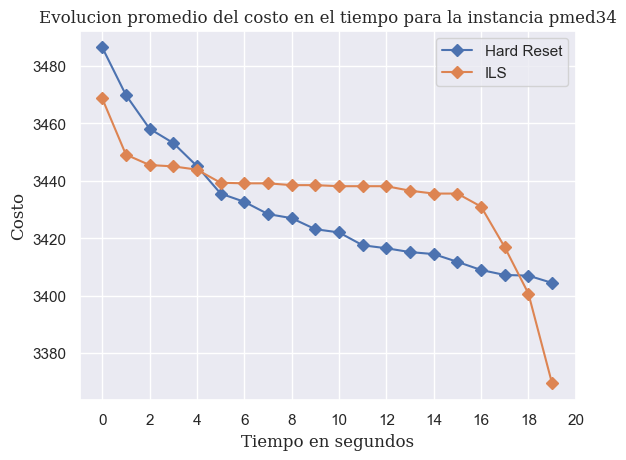
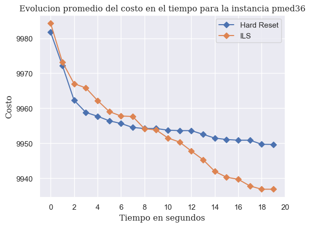
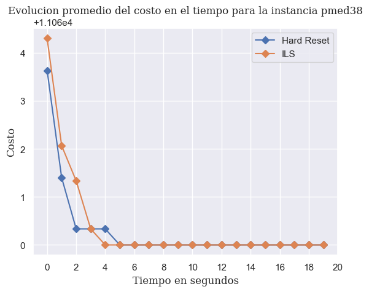
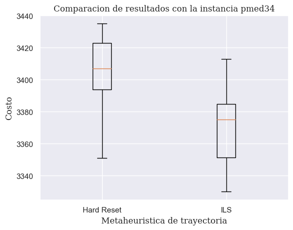
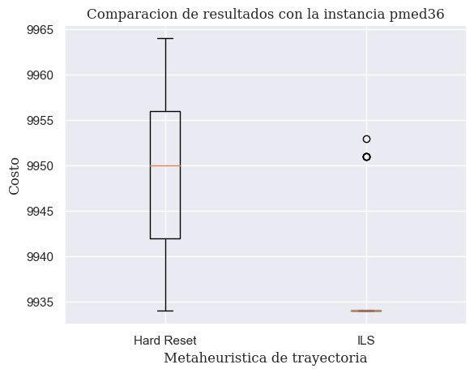
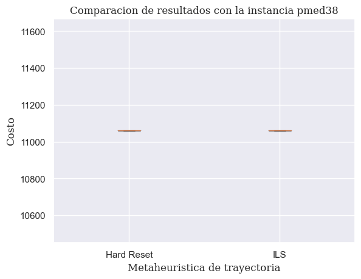

# Implementación

En esta práctica se realizó la implementación de dos metaheurísticas de trayectoria las cuales son la *búsqueda local con reinicio completo* y *iterated local search*. A continuación explicaremos la lógica de implementación de cada una de ellas.

- *Búsqueda local con reinicio completo:* Para el correcto funcionamiento de la implementación fue necesario realizar la inicialización y limpieza de la estructura `cost_sorted` dado que cada que realiza una búsqueda local se insertan elementos a la estructura. Considerando lo anterior, realizamos una búsqueda local, actualizamos la mejor solución global y comprobamos si el tiempo transcurrido sigue en el intervalo para una nueva iteración.

    ```c++
    do{
        Inicializamos la estructura cost_sorted
        Realizamos la busqueda local con una solucion inicial aleatoria
        Actualizamos globalBestCost si encontramos una mejor solucion
        Calculamos la variable elapsedTime de acuerdo al tiempo transcurrido
        Limpiamos la estructura cost_sorted
    }while(elapsedTime < finalTime)
    ```

- *Iterated Local Search:* Para esta implementación el desafio principal fue definir la manera de perturbar la mejor solución actual, se realizaron dos aproximaciones: 
  1. Como primer intento definimos una noción de distancia entre dos soluciones utilizando el *Algoritmo Húngaro* siendo la perturbación una solución aleatoria que se encuentre en un rango de distancia definido entre $[0, 1]$ donde la solución con distancia de valor $1$ representa la solución con mayor distancia encontrada hasta el momento respecto a la mejor solución actual. Es decir, si $maxDistance$ es la distancia con mayor valor y $distance$ es la distancia de una solución candidata para iniciar la búsqueda local, entonces la solución es aceptada si $distance/maxDistance < pertubationFactor$ donde $pertubationFactor$ es un factor de aceptación respecto a la lejanía de la solución candidata a la mejor solución actual, con el propósito de ir reduciendo el valor de $pertubationFactor$ aceptando así soluciones distantes al principio y soluciones cercanas al finalizar el algoritmo. Esta aproximación dio problemas dado que para encontrar soluciones generadas aleatoriamente a una distancia menor a $pertubationFactor=0.7$ era muy tardado, por ello se descartó esta aproximación.
  2. Como segunda aproximación se generó una noción de probabilidad, en donde $pertubationFactor$ representa la probabilidad de modificar la entrada $i$ de la mejor solución con un nuevo nodo aleatorio. Es decir `solution[i] = (rand()/RAND_MAX <= pertubationFactor) ? randomNode : globalBestSolution[i]`.
   
   Considerando lo anterior, el pseudocódigo es de la siguiente manera:

   ```c++
   Inicializamos la estructura cost_sorted
   Realizamos la busqueda local con una solucion inicial aleatoria
   Actualizamos globalBestCost
   Actualizamos globalBestSolution
   do{
      Limpiamos la estructura cost_sorted
      Inicializamos la estructura cost_sorted

      Realizamos la busqueda local con una solucion inicial perturbada
      Actualizamos globalBestCost y globalBestSolution si encontramos una mejor solucion

      Calculamos la variable elapsedTime de acuerdo al tiempo transcurrido
      Actualizamos pertubationFactor = 1.0 - (elapsedTime / finalTime) + eps  
   }while(elapsedTime < finalTime)
   ```

    Se puede observar que la actualización de $pertubationFactor \to 0$, por lo tanto añadimos la variable $eps$ para tener un margen de aceptación al final del tiempo transcurrido.

# Resultados

Se realizaron pruebas en *ILS* con valores de $eps \in \{0.1, 0.2, 0.5\}$ siendo el valor del parámetro $eps = 0.1$ el que proporcionó mejores resultados, por ello procederemos a mostrar las gráficas comparativas respecto a la *búsqueda local con reinicio completo* con dicha configuración.

Primeramente, tenemos el promedio de la evolución de la función de costo durante el tiempo, realizamos 30 ejecuciones de 20 minutos cada una obteniendo actualizaciones de la mejor solución encontrada en cada minuto.







Seguido de ello, tenemos las gráficas de tipo *Boxplots* comparando las metaheurística de *búsqueda local con reinicio completo* con *ILS* de los resultados obtenidos después de las 30 ejecuciones.







Finalmente, presentamos la tabla comparativa de los costos obtenidos.

| Instancia | Mejores Resultados | Tarea 1 | Tarea 2 | Tarea 3 | Tarea 4 |
| :---      |   :---:  | :---: | :---: | :---: | ---: |
| `pmed34` | $3013$  | $4087$  | $4014$  | $3475$  | $3330$ |
| `pmed36` | $9934$  | $10854$ | $10271$ | $10051$ | $9934$ |
| `pmed38` | $11060$ | $11306$ | $11383$ | $11060$ | $11060$ |
